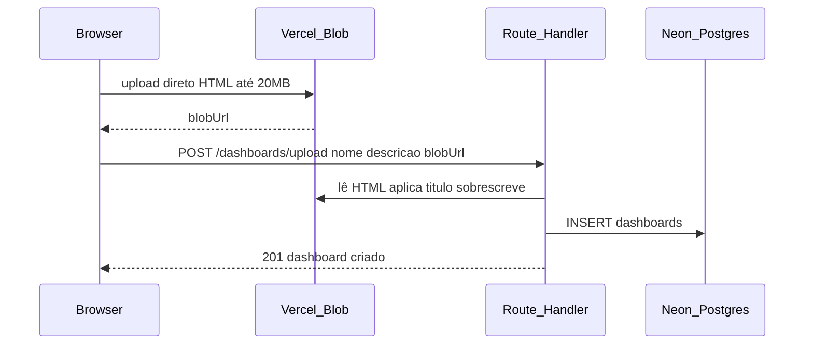

# Arquitetura

## Visão geral

```
Browser
   │
   ▼
Next.js (Vercel Hobby)
   ├── App Router (páginas React)
   ├── Route Handlers (/api/*)
   └── middleware.js (auth de rotas)
         │
         ├── Neon PostgreSQL (usuários, dashboards, permissões)
         ├── Vercel Blob (arquivos HTML)
         └── Upstash Redis (rate limit)
```

## Autenticação

1. `POST /api/auth/login` valida email/senha (bcrypt)
2. Gera JWT (8h) e define cookie **httpOnly** `tokenAnalyticsFunev`
3. `middleware.js` protege rotas do painel lendo o cookie
4. Route Handlers validam JWT no cookie ou header `Authorization: Bearer`
5. `POST /api/auth/logout` remove o cookie

### Perfis

| Perfil | Acesso |
|--------|--------|
| `admin` | Todos os dashboards + publicar + usuários + permissões |
| `usuario` | Apenas dashboards permitidos em `usuarios_dashboards` |

## Fluxo de upload (Vercel gratuita)



No plano Hobby, o HTML **nunca** passa pelo body da função serverless (limite 4,5 MB).

## Modelo de dados

### usuarios

| Coluna | Tipo | Descrição |
|--------|------|-----------|
| id | TEXT PK | UUID |
| nome | TEXT | Nome completo |
| email | TEXT UNIQUE | Login |
| senha_hash | TEXT | bcrypt (12 rounds) |
| perfil | TEXT | `admin` ou `usuario` |
| criado_em | TIMESTAMPTZ | Data de criação |

### dashboards

| Coluna | Tipo | Descrição |
|--------|------|-----------|
| id | TEXT PK | UUID |
| nome | TEXT | Nome exibido |
| descricao | TEXT | Descrição / título HTML |
| arquivo | TEXT | URL do Blob ou nome local |
| criado_em | TIMESTAMPTZ | Data de publicação |

### usuarios_dashboards

| Coluna | Tipo | Descrição |
|--------|------|-----------|
| usuario_id | TEXT FK | Referência usuarios |
| dashboard_id | TEXT FK | Referência dashboards |
| PK | (usuario_id, dashboard_id) | Permissão |

## Visualizador

- Rota: `/visualizador/[id]`
- Busca HTML via `GET /api/dashboards/:id/conteudo`
- Renderiza em `<iframe srcDoc sandbox="allow-scripts allow-same-origin allow-popups">`
- HTML é conteúdo não confiável — ver [MELHORIAS_FUTURAS.md](MELHORIAS_FUTURAS.md)

## Rate limiting

| Endpoint | Limite |
|----------|--------|
| `POST /api/auth/login` | 10 tentativas / 15 min por IP |
| Demais `/api/*` | 200 req / min por IP |

Produção: Upstash Redis. Desenvolvimento local: fallback em memória.

## Estrutura de pastas

Ver [README.md](../README.md#estrutura).
